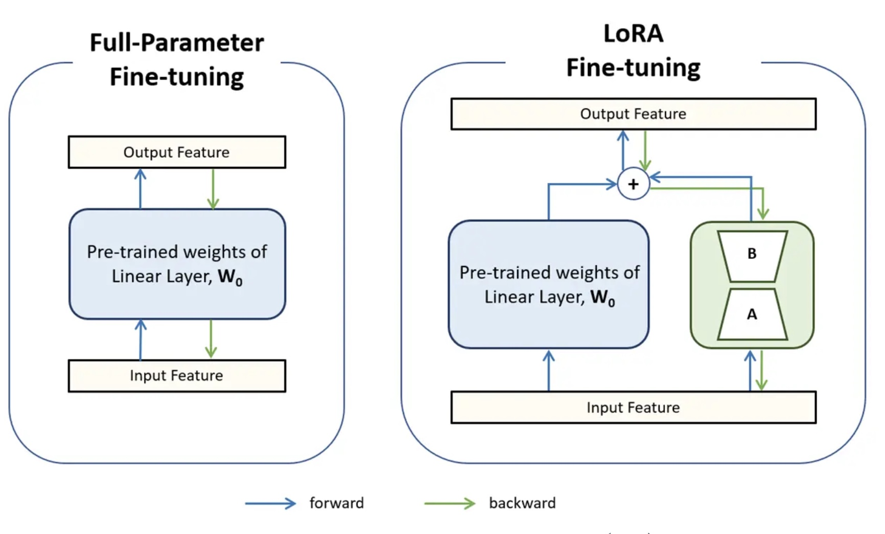
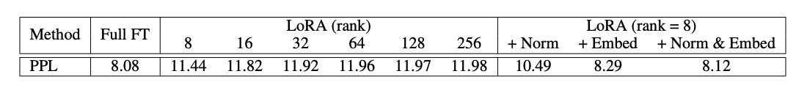
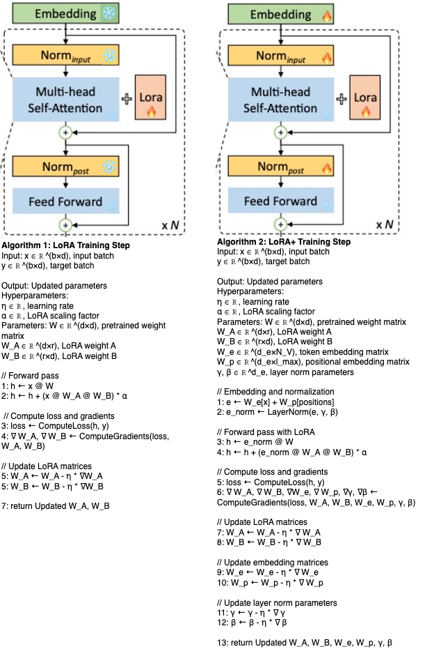
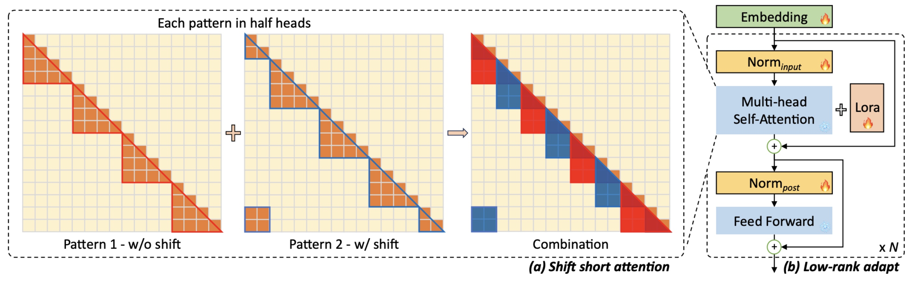

# DS 5690: LongLoRA Paper Presentation

## Rubric Deliverables

| **Deliverable**          | **Where You Can Find It**                                                  |
|--------------------------|-----------------------------------------------------------------------------|
| Repository                | You are here  📍                                                           |
| Presentation materials    | [README.md](README.md)                                                     |
| Overview                  | Motivation & Problem Statement sections           |
| Question 1                | Architecture Overview > S2-Attn section            |
| Question 2                | Architecture Overview > LoRA+ section              |
| Architecture overview     | Architecture Overview sectio                      |
| Critical Analysis         | Critical Analysis section                          |
| Impacts                   | Impacts section                                    |
| Resource links            | Resource Links section                             |
| Code demonstration        | [LongLoRA_finetune_demo.ipynb](LongLoRA_finetune_demo.ipynb), [s2_attention_example.ipynb](s2_attention_example.ipynb) |
| Citation for paper        | References section                             |


<br/>
<br/>

## Motivation 

**Context Length:** Maximum input tokens an LLM can process in a single query, acting as the model's effective "memory window"

* Longer context allows LLMs to handle:
	* Entire documents, including research papers or even books
	* Large databases or codebases
	* Multiple data sources simultaneously
 	* Extended conversations or multi-turn dialogues
 	* Complex tasks requiring integration of information from various parts of a long input

* Current Limitations
	* Most LLMs are pre-trained with fixed context sizes which restrict LLMs in many applications such as:
		* Summarizing long documents
		* Answering questions about extensive content
		* Maintaining coherence in long conversations
		* Analyzing large datasets or codebases in their entirety
		* Performing tasks that require understanding of broader context or long-term dependencies
 
<br/>
<br/>


## Problem Statement : Extending context length is not trivial 

* Computational Complexity:
	* $O(n^2)$ scaling with sequence length
	* Extending from 2,048 to 8,192 context length requires **16×** more computation in self-attention layers

<p align="center">
  
  

  <i>3Blue1Brown</i>
</p>


* Memory Usage:
	* Storage of attention matrices
	* This often exceeds the capacity of available hardware, especially for larger models
* Model Quality:
	* Models may overfit to specific long-context patterns seen during training
	* Ensuring generalization to various types of long-context tasks is crucial

<br/>
<br/>

## Current Approaches 

* Long-context Transformers and their limitations
	* Sparse Attention Mechanisms:
		* Approach: Using various sparse attention patterns to reduce computational complexity
  		* Examples: [Longformer](https://huggingface.co/docs/transformers/en/model_doc/longformer), [BigBird](https://huggingface.co/docs/transformers/en/model_doc/big_bird)
		* Limitation: May sacrifice some performance or struggle with certain types of long-range dependencies

	* Recurrent Memory Mechanisms:
		* Approach: Incorporating explicit memory structures to extend effective context
		* Examples: [Transformer-XL](https://huggingface.co/docs/transformers/en/model_doc/transfo-xl), [Compressive Transformers](https://arxiv.org/abs/1911.05507)
		* Limitation: Compressions have a large gap to full attention, making it infeasible to fine-tune pre-trained LLMs

	* Retrieval-Augmented Models:
		* Approach: Combining LLMs with external retrieval systems to access relevant information
		* Examples: [REALM](https://huggingface.co/docs/transformers/en/model_doc/realm), RAG (Retrieval-Augmented Generation)
		* Limitation: Relies on effective retrieval systems and may struggle with seamless integration of retrieved information

	* Context Compression Techniques:

		* Approach: Dynamically compressing or summarizing past context
		* Examples: [LongNet](https://arxiv.org/abs/2307.02486), [Memorizing Transformers](https://arxiv.org/abs/2203.08913)
		* Limitation: May lose some fine-grained details in the compression process


* Long-context LLMS and their limitations:
 	* Full Fine-tuning:
 		* Approach: Retraining the entire model on longer sequences
 		* Limitation: Extremely resource-intensive
   		* Example: [Position Interpolation](https://arxiv.org/abs/2306.15595) method used 32 A100 GPUs for 2k to 8k context extension, 128 A100 GPUs for longer context fine-tuning
     	* Other methods like [Landmark Attention](https://arxiv.org/abs/2305.16300) are efficient, but prone to losing information 

<br/>
<br/>

## Core Tradeoff: Efficiency vs Full Information Retention ##

* Most existing solutions lean heavily towards one side of this tradeoff:
	* Full fine-tuning approaches retain all information but are prohibitively expensive, often requiring hundreds of GPUs.
	* Efficient methods like sparse attention or compression techniques sacrifice some degree of information retention or accessibility.

* What if _we_ (collective of AI students and researchers without acces to swaths of VC funding or infinite time) want to
	* 🔬 a model to understand and summarize entire research papers, including methods, results, and discussions?
	* ⚖️ a model to analyze entire contracts, identifying key clauses and potential issues across hundreds of pages?
	* 🩺 a model to analyze a patient's complete medical record, including years of notes, test results, and treatments, to assist in diagnosis and treatment planning?
	* 💻 a model to understand entire codebases, providing more context-aware suggestions and bug detection across multiple files and functions?
	* 📚 a model to analyze textbooks and generate tailored lesson plans, quizzes, and study guides that cover entire subjects or courses?
	* 💰 a model to process entire quarterly reports, market analyses, and historical data to provide more comprehensive investment insights?

* Is it possible to achieve a solution that offers the best of both worlds – efficient processing of long contexts without sacrificing the model's ability to access and use all the information?


Introducing ... **[LongLoRA](https://arxiv.org/abs/2309.12307)** ! LongLoRA aims to address this challenge by providing a method that:

1. Significantly reduces computational requirements compared to full fine-tuning.
2. Maintains the model's ability to access and process the full extended context during inference.

Using this method, researchers were able to extend Llama2 7B to 100k context length and 70B model to 32k context length, on a **single** 8× A100 machine. 

<br/>
<br/>

## LoRA Refresher  

* LoRA(Low-Rank Adaptation) is a method for efficiently fine-tuning large AI models by reducing the number of parameters that need to be updated
* **Key Idea**: Instead of updating the entire weight matrix during fine-tuning, LoRA constrains the weight updates to a low-rank space, significantly reducing computational cost.
* **How it works**
	* Weight updates are represented as a low-rank decomposition: ΔW = BA (B and A are low-rank matrices).
	* This reduces the number of parameters to update from nk to r(n + k), where r << min(n, k).
 * Enables the adaptation of large models to specific tasks without the heavy computational burden of traditional fine-tuning, which is particularly useful in low-data regimes or when computation resources are limited
 * Good for AI teams' budgets and the environment

<p align="center" width="100%">

</p>


* Empirical evidence has found that using LoRA for context extension is neither _effective_ or _efficient_
	* has high perplexity (less certainty in predictions)
  	* standard self-attention mechanism (Vaswani et al., 2017) still yields dramatic increases in computational complexity as context length extends 


<br/>
<br/>

## Architecture Overview

### Major Contributions of LongLoRA:

* Shifted Sparse Attention (S2-Attn)
* Improved LoRA (LoRA+)

### Key Questions 

Q1: How does S2-Attn work and why is it effective?

Q2: What improvements does LongLoRA make to standard LoRA?


### Key components of LongLoRA:

#### Shifted Sparse Attention (S2-Attn)

* **Definition:**
	* S2-Attn is an efficient approximation of full attention used during training.
	* It closely mimics the behavior of full attention, just with reduced computation

<p align="center" width="100%">

</p>

* **How it works**:
	* Splits the input sequence into several groups.
   		* Original:  [A B C D E F G H]
		* Unshifted: [A B C D] [E F G H]
		* Shifted:    [C D E F] [G H A B]
	* Applies attention separately within each group.
 		* Head 0: [A B C D]
   		* Head 1: [E F G H]
	* In half of the attention heads, shifts the group partition by half the group size.
 		* Head 2: [C D E F]
   		* Head 3: [G H A B]
     	* Each token to have access to both its local context (in the unshifted heads) and a broader context (in the shifted heads)
      		* Token C has access to A, B, D (local context in Head 0) and E, F (broader context in Head 2).	 

* **Implementation**:
	* Can be implemented with just two lines of code during training.
	* Does not require changes to the model architecture for inference.
	* See [s2_attention_example.ipynb](https://github.com/isabelarvelo/LongLoRA/blob/main/s2_attention_example.ipynb) for a more in depth walk through 

 
<p align="center" width="100%">

</p>


* **Benefits**:
	* Reduces computational cost significantly during training.
	* Enables information flow between different groups through shifting.
	* Achieves performance close to full attention fine-tuning.

* **Comparison to other attention patterns**:
	* Unlike other efficient attention designs (e.g., dilated or sparse attention), S2-Attn has a smaller gap to standard attention.
	* Models fine-tuned with S2-Attn retain the original attention architecture during inference which allows the use of existing optimizations and infrastructure for inference
		* The shifting mechanism in S2-Attn prevents the model from overfitting to specific attention patterns, which allows it to generalize better when using full attention during inference.
 	* <p align="center" width="100%"></p>
  
	* When testing with the same attention pattern used in training (first row), S2-Attn performs well (8.64 perplexity)
	* When testing with full attention (second row), S2-Attn still performs well (8.12 perplexity).
	* Other attention patterns like dilated, block sparse, and stride sparse attention show larger discrepancies between training and full-attention testing, or perform poorly overall.

✅ Significantly reduces computational requirements compared to full fine-tuning

🤏🏼 Maintains the model's ability to access and process the full extended context during inference 


</br>
</br>


#### Improved LoRA (LoRA+)

Remember that computational efficiency was not the only thing holding LoRA back, researchers also observed that standard LoRA had high perplexity (less certainty in predictions) when used for context extension, even with larger rank sizes. 

**Key Innovation:**
* LoRA+ enhances the standard LoRA method by making embedding and normalization layers trainable, in addition to the attention layers typically adapted in LoRA.
* These layers occupy a small proportion of total parameters but are crucial for long-context learning.

**Parameter Efficiency:**
* Embedding: <2% of parameters in Llama2 7B
* Normalization: ≤0.004% of parameters

**Performance:**
* Making embedding and normalization trainable significantlt closes this gap between standard LoRA and full fine-tuning for long contexts.
* Achieves comparable results to full fine-tuning with much lower computational cost.

<p align="center" width="100%">

</p>

* Standard LoRA, even with increasing rank, fails to close the performance gap with full fine-tuning for long-context adaptation (perplexity of 11.44-11.98 vs 8.08 for full fine-tuning).
* Making normalization and embedding layers trainable is crucial for effective long-context adaptation, with LoRA + trainable normalization and embedding layers achieving a perplexity of 8.12, nearly matching full fine-tuning's 8.08.
* The combination of trainable normalization and embedding layers in LoRA provides a significant performance boost compared to using either alone


### Pseudocode description

<p align="center" width="100%">

</p>


Bringing it all together, we get LongLoRA

<p align="center" width="100%">

</p>

✅ Significantly reduces computational requirements compared to full fine-tuning

✅ Maintains the model's ability to access and process the full extended context during inference 

<br/>
<br/>

## Impacts

### Significance for efficient LLM adaptation 
* Democratization of LLM fine-tuning through reduced compute requirements and clearer evaluation frameworks
* Cost-effective model improvement by identifying which capabilities actually matter for specific applications
* Environmental benefits from targeted optimization rather than training larger models
* Bridging research-application gap by focusing on real-world tasks over synthetic benchmarks

### Potential applications and use cases
* Document analysis and summarization
  * Legal contract review across multiple documents
  * Scientific literature synthesis spanning hundreds of papers
  * Corporate document compliance checking
* Enhanced question-answering systems
  * Medical diagnosis support using full patient histories
  * Technical support systems drawing from entire product documentation
  * Academic research assistants analyzing full research papers
* Long-form content generation
  * Automated report writing incorporating multiple data sources
  * Book-length content creation with consistent narrative
  * Personalized educational content adapting to student context

### Future implications for long-context understanding in AI
* Autonomous task completion with reduced human intervention
  * Self-guided research and analysis
  * End-to-end project planning and execution
* Cross-modal long-context understanding
  * Integration of text, code, and structured data
  * Analysis of multi-format documents (PDFs, spreadsheets, presentations)
* Improved few-shot learning through better context utilization
  * Faster adaptation to new domains
  * More efficient transfer learning


<br/>
<br/>

## Code Demo 

This [demo](https://github.com/isabelarvelo/LongLoRA/blob/main/LongLoRA_finetune_demo.ipynb) illustrates how LongLoRA enables efficient, resource-friendly fine-tuning of large language models with extended context lengths, making advanced NLP capabilities more accessible and adaptable to specific domains like medical question-answering.

* Model and Data Setup:
	* The demo uses a pre-trained 1.4 billion parameter model (EleutherAI/pythia-1.4b-deduped).
 	* It fine-tunes this model on a medical question-answering dataset (lavita/medical-qa-datasets) containing 239k examples.

* Efficient Fine-tuning:
	* LongLoRA is applied, enabling fine-tuning of only specific parts of the model (embeddings and normalization layers) along with low-rank adaptation.
	* The model is quantized to 4-bit precision, significantly reducing memory requirements.
	* These techniques make it possible to fine-tune a large model on a single GPU (NVIDIA A100) through Google Colab. 

* Extended Context Length:
	* The model's context length is extended from its original size to 32,768 tokens, a significant increase that allows for processing much longer inputs.

* Fast Training:
	* After data loading and tokenization, the fine-tuning process only takes only about 31 minutes on a single A100 GPU.
	* This is remarkably fast for fine-tuning a 1.4B parameter model on nearly 240,000 examples.

* Model Merging and Deployment:
	* After fine-tuning, the adapter weights are merged back into the base model.
	* The resulting model is then pushed to the Hugging Face Hub, making it easily accessible for future use.

## Additional Contributions 

In addition to the methodological advancements of LongLoRA, the authors have made several practical contributions that benefit the AI research community:
* The authors have released several LLM variants with extended context lengths including:
	* Llama2 7B extended to 100k context length
	* Llama2 13B extended to 65,536 context length
	* Llama2 70B extended to 32,768 context length
 	* _All of the models trained and released for this work can be found linked below in the Original ReadME_

* LongAlpaca Dataset
	* The authors introduce a new dataset called LongAlpaca, specifically designed for long-context instruction following:
	* Composition: 9,000 long-context question-answer pairs and 3,000 short QAs sampled from the original Alpaca data
	* Content: Includes materials like technical papers, science fiction, and other books
	* Question types: Summarization, relationships, characters, and other context-specific queries

* Benchmarking Results
	* The paper presents extensive benchmarking results:
		* Comparisons with existing long-context models on various tasks
		* Performance evaluations on standard benchmarks like PG19 and proof-pile datasets
		* These results serve as baselines for future research in long-context language modeling

<br/>
<br/>

## Critical Analysis 

* Over-reliance on Perplexity
	* Perplexity primarily measures prediction uncertainty, but does not account for other factors such as coherence, fluency, or semantic understanding and may not directly translate to task performance
 	* Models can achieve low perplexity while generating repetitive or uninteresting (low diversity) text

* Limited Real-World Task Evaluation
	* Paper primarily focuses on synthetic tasks (e.g., passkey retrieval) that are not strong predictors of real-world performance
	* Unclear how synthetic tasks actually correlate with downstream capabilities
	* Missing evaluation on task specific metrics like:
		* Document summarization(ROUGE)
		* Named Entity Recognition (seqeval)
		* Quality of Text (MAUVE) 

* Open Questions
	* Do our current metrics suffice for long context models or is there a better way to evaluate complex capabilities like cross-document reasoning and information integration?
 	* [How to Evaluate Long-Context Language Models
Effectively and Thoroughly(HELMET)](https://arxiv.org/pdf/2410.02694) (published over Fall Break)
        * With the LongAlpaca dataset, better metrics can be developef to test frontier long-context abilities

<br/>
<br/>

## Other methodology worth mentioning 
While LongLoRA's primary contributions are S2-Attn and LoRA+, the paper leverages several other important techniques that are crucial for efficient long-context fine-tuning:

* DeepSpeed:
	* Implements Zero Redundancy Optimizer (ZeRO) to optimize memory usage
	* Allows for efficient training of large models by partitioning model parameters, gradients, and optimizer states across GPUs
	* Reduces memory redundancy in data-parallel training, enabling larger models and batch sizes
 	* (Rasley et al., 2020)

* Position Interpolation (PI):
	* Enables LLMs to handle longer context windows without the need for training from scratch
	* Works by interpolating between learned positional embeddings to extend to longer sequences
	* Provides a foundation for LongLoRA to build upon for context extension
 	* (Chen et al., 2023)

* FlashAttention2:
	* Reorders the attention computation and leverages classical techniques (tiling, recomputation) to significantly speed it up and reduce memory usage
	* Optimizes the memory access patterns in attention calculations
	* Crucial for efficient processing of long sequences in both training and inference
 	* (Dao, 2023) 
    
* Gradient Checkpointing:
	* A technique to reduce memory usage during backpropagation by recomputing intermediate activations instead of storing them
	* Allows for training of deeper models or with larger batch sizes at the cost of increased computation time
 	* (Chen et al., 2023)


## Resource Links
* This repository is forked from the [LongLoRA orginal repository](https://github.com/dvlab-research/LongLoRA) 
* Quick Links to related papers
	* [LongLoRA](https://arxiv.org/abs/2309.12307)
 	* [LoRA: Low-Rank Adaptation of Large Language Models](https://arxiv.org/abs/2106.09685)
	* [LoRA GitHub Repository](https://github.com/microsoft/LoRA)
 	* [Positional Interpolation](https://arxiv.org/abs/2306.15595)
  	* [FlashAttention2](https://arxiv.org/abs/2307.08691)
  	* [DeepSpeed](https://dl.acm.org/doi/10.1145/3394486.3406703)
  	* [Gradient Checkpointing](https://arxiv.org/abs/1604.06174)
  	
* Relevant blog posts and videos 
	* [How to code long-context LLM: LongLoRA explained on LLama 2 100K](https://www.youtube.com/watch?v=hf5N-SlqRmA)
 	* [The Remedy for Fine-Tuning LLMs in Long Context – LongLoRA](https://hkaift.com/the-remedy-for-fine-tuning-llms-in-long-context-longlora/) 
 	* [HuggingFace Collection of Long Context Articles](https://huggingface.co/collections/stereoplegic/long-context-65389c8f0e9beb3a415b3356)
  	* [HuggingFace Discussion of LongLoRA](https://huggingface.co/papers/2309.12307)
  	* LongAlpaca and models with context extension via improved LoRA fine-tuning and full fine-tuning can be found in the original README below
  	* [100k context length Llama 7B....How?](https://jacksoncakes.com/2023/10/05/longlora-efficient-fine-tuning-of-long-context-large-language-models/)
  	* [Easily Train a Specialized LLM: PEFT, LoRA, QLoRA, LLaMA-Adapter, and More](https://cameronrwolfe.substack.com/p/easily-train-a-specialized-llm-peft)
  	* [3Blue1Brown](https://www.youtube.com/watch?v=eMlx5fFNoYc&t=779s) for explanation of Attention 

<br/>
<br/>

# References

Ashish Vaswani, Noam Shazeer, Niki Parmar, Jakob Uszkoreit, Llion Jones, Aidan N. Gomez, Lukasz Kaiser, and Illia Polosukhin. Attention is
	all you need. In NeurIPS, pp. 5998–6008, 2017.

Shouyuan Chen, Sherman Wong, Liangjian Chen, and Yuandong Tian. Extending context window of large language models via positional 
	interpolation. CoRR, abs/2306.15595, 2023.

Manzil Zaheer, Guru Guruganesh, Kumar Avinava Dubey, Joshua Ainslie, Chris Alberti, Santiago Ontan˜on, Philip Pham, Anirudh Ravula, Qifan 
	Wang, Li Yang, and Amr Ahmed. Big bird: Transformers for longer sequences. In NeurIPS, 2020.

Tri Dao. Flashattention-2: Faster attention with better parallelism and work partitioning. CoRR, abs/2307.08691, 2023.

Jianlin Su, Yu Lu, Shengfeng Pan, Bo Wen, and Yunfeng Liu. Roformer: Enhanced transformer with rotary position embedding. CoRR, 
	abs/2104.09864, 2021.

Jeff Rasley, Samyam Rajbhandari, Olatunji Ruwase, and Yuxiong He. Deepspeed: System optimizations enable training deep learning models with 
	over 100 billion parameters. In KDD, pp.3505–3506. ACM, 2020.

Tianqi Chen, Bing Xu, Chiyuan Zhang, and Carlos Guestrin. 2016. Training deep nets with sublinear memory cost. arXiv preprint 
	arXiv:1604.06174 (April 2016).

Sourab Mangrulkar, Sylvain Gugger, Lysandre Debut, Younes Belkada, and Sayak Paul. Peft: Stat eof-the-art parameter-efficient fine-tuning 
	methods. https://github.com/huggingface/peft, 2022.


<br/>
<br/>
<br/>
<br/>
<br/>
<br/>


## Original LongLoRA README:

<br/>
<br/>

<p align="center" width="100%">

</p>

# LongLoRA and LongAlpaca for Long-context LLMs


[](https://huggingface.co/Yukang)
[](https://huggingface.co/datasets/Yukang/LongAlpaca-12k)
[](https://arxiv.org/abs/2309.12307)

[](https://github.com/dvlab-research/LongLoRA/blob/main/LICENSE)
[](https://github.com/dvlab-research/LongLoRA/blob/main/DATA_LICENSE)
[](https://github.com/dvlab-research/LongLoRA/blob/main/WEIGHT_LICENSE)


## TABLE OF CONTENTS
1. [News](#news)
2. [Highlights](#highlights)
3. [How to contribute](#how-to-contribute)
4. [Requirements](#usage-requirements)
5. [Installation and quick guide](#installation-and-quick-guide)
6. [LongAlpaca Data](#longalpaca-data)
7. [Models](#models)
8. [Training](#training)
9. [Evaluation](#evaluation)
10. [Demo](#demo)
11. [Streaming Inference](#streaming-inference)
12. [Data Generation via Pdf2Text](#data-generation-via-pdf2text)
13. [Examples](#examples)
14. [Citation](#citation)
15. [Acknowledgement](#acknowledgement)
16. [License](#license)
      
## News
- [x] [2024.1.17] [LongLoRA](https://arxiv.org/abs/2309.12307) has been accepted by **ICLR 2024** as an **Oral** presentation.
- [x] [2023.11.19] We release a new version of LongAlpaca models, [LongAlpaca-7B-16k](https://huggingface.co/Yukang/LongAlpaca-7B-16k), [LongAlpaca-7B-16k](https://huggingface.co/Yukang/LongAlpaca-13B-16k), and [LongAlpaca-7B-16k](https://huggingface.co/Yukang/LongAlpaca-70B-16k). These models are fine-tuned on a subset LongAlpaca-12k dataset with LongLoRA in SFT, [LongAlpaca-16k-length](https://huggingface.co/datasets/Yukang/LongAlpaca-16k-length). We evaluate the [LongAlpaca-7B-16k](https://huggingface.co/Yukang/LongAlpaca-7B-16k) model on LongBench and L-Eval benchmarks and results can be found [here](https://github.com/dvlab-research/LongLoRA/tree/main/benchmarks).
- [x] [2023.11.2] We have updated our LongAlpaca models from alpaca prompting to llama2 prompting, which is consistent to their pre-trained models. Please refer to the [inference code](https://github.com/dvlab-research/LongLoRA/blob/2345c6d030f61ac3a031906386a103a5b05e0e6f/inference.py#L18) with the llama2 prompting.
- [x] [2023.10.23] We support the combination of [QLoRA](https://github.com/artidoro/qlora) and LongLoRA in the [supervised fine-tuning](supervised-fine-tune-qlora.py), for further reduction of the GPU memory cost. We release the LoRA weights of a 7B model at [LongAlpaca-7B-qlora-weights](https://huggingface.co/Yukang/LongAlpaca-7B-qlora-weights).
- [x] [2023.10.18] We support [StreamingLLM](https://github.com/mit-han-lab/streaming-llm) inference on our LongAlpaca models. This increases the context-length of the multi-round dialogue in StreamingLLM.
- [x] [2023.10.8] **We release the long instruction-following dataset**, [LongAlpaca-12k](https://huggingface.co/datasets/Yukang/LongAlpaca-12k) and **the corresponding models**, [LongAlpaca-7B](https://huggingface.co/Yukang/LongAlpaca-7B), [LongAlpaca-13B](https://huggingface.co/Yukang/LongAlpaca-13B), and [LongAlpaca-70B](https://huggingface.co/Yukang/LongAlpaca-70B).
- (*The previous sft models*, [Llama-2-13b-chat-longlora-32k-sft](https://huggingface.co/Yukang/Llama-2-13b-chat-longlora-32k-sft) and [Llama-2-70b-chat-longlora-32k-sft](https://huggingface.co/Yukang/Llama-2-70b-chat-longlora-32k-sft), *have been deprecated*.)
- [x] [2023.10.3] We add support GPTNeoX models. Please refer to this [PR](https://github.com/dvlab-research/LongLoRA/pull/32) for usage. Thanks for @naubull2 for this contribution.
- [x] [2023.9.22] We release all our fine-tuned [models](https://huggingface.co/Yukang), including **70B-32k models**, [LLaMA2-LongLoRA-70B-32k](https://huggingface.co/Yukang/Llama-2-70b-longlora-32k), [LLaMA2-LongLoRA-7B-100k](https://huggingface.co/Yukang/Llama-2-7b-longlora-100k-ft). Welcome to check them out!
- [x] [2023.9.22] We release [Paper](http://arxiv.org/abs/2309.12307) and this GitHub repo, including training and evaluation code.

**LongLoRA: Efficient Fine-tuning of Long-Context Large Language Models [[Paper](http://arxiv.org/abs/2309.12307)]** <br />
[Yukang Chen](https://scholar.google.com/citations?user=6p0ygKUAAAAJ&hl=en),
[Shengju Qian](https://scholar.google.com/citations?user=QNnWmasAAAAJ),
[Haotian Tang](https://scholar.google.com/citations?user=WxL13BAAAAAJ&hl),
[Xin Lai](https://scholar.google.com/citations?user=tqNDPA4AAAAJ&hl=zh-CN),
[Zhijian Liu](https://scholar.google.com/citations?user=3coYSTUAAAAJ&hl=en),
[Song Han](https://scholar.google.com/citations?user=E0iCaa4AAAAJ&hl=zh-CN),
[Jiaya Jia](https://scholar.google.com/citations?user=XPAkzTEAAAAJ&hl=en)<br />

## Highlights
1. In LongLoRA approach, The proposed shifted short attention is easy to implement, compatible with Flash-Attention, and is not required during inference.
2. We released all our models, including models from 7B to 70B, context length from 8k to 100k, including [LLaMA2-LongLoRA-7B-100k](https://huggingface.co/Yukang/Llama-2-7b-longlora-100k-ft), [LLaMA2-LongLoRA-13B-64k](https://huggingface.co/Yukang/Llama-2-13b-longlora-64k), and [LLaMA2-LongLoRA-70B-32k](https://huggingface.co/Yukang/Llama-2-70b-longlora-32k).
3. We built up a long-context instruction-following dataset, [LongAlpaca-12k](#longalpaca-data). We released the corresponding [LongAlpaca-7B](https://huggingface.co/Yukang/LongAlpaca-7B), [LongAlpaca-13B](https://huggingface.co/Yukang/LongAlpaca-13B) and [LongAlpaca-70B](https://huggingface.co/Yukang/LongAlpaca-70B) models. To our best knowledge, this is the first open-sourced long-context 70B model.


## How to Contribute
- Make sure to have git installed.
- Create your own [fork](https://github.com/dvlab-research/LongLoRA/fork) of the project.
- Clone the repository on your local machine, using git clone and pasting the url of this project.
- Read both the `Requirements` and `Installation and Quick Guide` sections below.
- Commit and push your changes.
- Make a pull request when finished modifying the project.


## Usage Requirements
To download and use the [pre-trained weights](#pre-trained-weights) you will need:
1. Hugging Face (HF) account with valid email. Note, the email used for HF must alse be used for the license agreement.
2. Accept the Meta [license and acceptable use policy](https://ai.meta.com/resources/models-and-libraries/llama-downloads/) 


## Installation and Quick Guide
To install and run the application:
1. [Fork this repo](https://github.com/dvlab-research/LongLoRA/fork) on github
2. Clone the repository on your local machine, using git clone and pasting the url of this project.
3. Run the following code:
```
pip install -r requirements.txt
pip install flash-attn --no-build-isolation
```
4. Use either a [Released model](#released-models) or [Fine tune](#fine-tuning) a model to fit your preferences.
5. Test your model by chat.
6. Deploy your own demo.

## LongAlpaca Data

LongAlpaca-12k contains 9k long QA data that we collected and 3k short QA sampled from the original [Alpaca data](https://github.com/tatsu-lab/stanford_alpaca/blob/main/alpaca_data.json). This is to avoid the case that the model might degrade at short instruction following. The data we collect contains various types and amounts as the following figure.

<p align="center" width="100%">

</p>


| Data           | Short QA | Long QA  | Total    | Download |
|:---------------|----------|----------|----------|----------|
| LongAlpaca-12k | 3k       | 9k       | 12k      | [Link](https://huggingface.co/datasets/Yukang/LongAlpaca-12k) |

Following the original Alpaca format, our Long QA data uses the following prompts for fine-tuning:
- `instruction`: `str`, describes the task the model should perform. For example, to answer a question after reading a book section or paper. We vary the contents and questions to make instructions diverse.
- `output`: `str`, the answer to the instruction.

We did not use the `input` format in the Alpaca format for simplicity.

## Models

### Models with supervised fine-tuning
| Model          | Size | Context | Train   | Link                                                       |
|:---------------|------|---------|---------|------------------------------------------------------------|
| LongAlpaca-7B  | 7B   | 32768   | Full FT | [Model](https://huggingface.co/Yukang/LongAlpaca-7B)       |
| LongAlpaca-13B | 13B  | 32768   | Full FT | [Model](https://huggingface.co/Yukang/LongAlpaca-13B)      |
| LongAlpaca-70B | 70B  | 32768   | LoRA+ | [Model](https://huggingface.co/Yukang/LongAlpaca-70B) [(LoRA-weight)](https://huggingface.co/Yukang/LongAlpaca-70B-lora) |


### Models with context extension via fully fine-tuning
| Model                       | Size | Context | Train | Link                                                              |
|:----------------------------|------|---------|-------|-------------------------------------------------------------------|
| Llama-2-7b-longlora-8k-ft   | 7B   | 8192    | Full FT    | [Model](https://huggingface.co/Yukang/Llama-2-7b-longlora-8k-ft)  |
| Llama-2-7b-longlora-16k-ft  | 7B   | 16384   | Full FT    | [Model](https://huggingface.co/Yukang/Llama-2-7b-longlora-16k-ft)  |
| Llama-2-7b-longlora-32k-ft  | 7B   | 32768   | Full FT    | [Model](https://huggingface.co/Yukang/Llama-2-7b-longlora-32k-ft)  |
| Llama-2-7b-longlora-100k-ft | 7B   | 100000  | Full FT    | [Model](https://huggingface.co/Yukang/Llama-2-7b-longlora-100k-ft) |
| Llama-2-13b-longlora-8k-ft  | 13B  | 8192    | Full FT    | [Model](https://huggingface.co/Yukang/Llama-2-13b-longlora-8k-ft)  |
| Llama-2-13b-longlora-16k-ft | 13B  | 16384   | Full FT    | [Model](https://huggingface.co/Yukang/Llama-2-13b-longlora-16k-ft) |
| Llama-2-13b-longlora-32k-ft | 13B  | 32768   | Full FT    | [Model](https://huggingface.co/Yukang/Llama-2-13b-longlora-32k-ft) |

### Models with context extension via improved LoRA fine-tuning
| Model                       | Size | Context | Train | Link                                                                |
|:----------------------------|------|---------|-------|---------------------------------------------------------------------|
| Llama-2-7b-longlora-8k      | 7B   | 8192    | LoRA+ | [LoRA-weight](https://huggingface.co/Yukang/Llama-2-7b-longlora-8k) |
| Llama-2-7b-longlora-16k     | 7B   | 16384   | LoRA+ | [LoRA-weight](https://huggingface.co/Yukang/Llama-2-7b-longlora-16k)       |
| Llama-2-7b-longlora-32k     | 7B   | 32768   | LoRA+ | [LoRA-weight](https://huggingface.co/Yukang/Llama-2-7b-longlora-32k)       |
| Llama-2-13b-longlora-8k     | 13B  | 8192    | LoRA+ | [LoRA-weight](https://huggingface.co/Yukang/Llama-2-13b-longlora-8k)       |
| Llama-2-13b-longlora-16k    | 13B  | 16384   | LoRA+ | [LoRA-weight](https://huggingface.co/Yukang/Llama-2-13b-longlora-16k)      |
| Llama-2-13b-longlora-32k    | 13B  | 32768   | LoRA+ | [LoRA-weight](https://huggingface.co/Yukang/Llama-2-13b-longlora-32k)      |
| Llama-2-13b-longlora-64k    | 13B  | 65536   | LoRA+ | [LoRA-weight](https://huggingface.co/Yukang/Llama-2-13b-longlora-64k)      |
| Llama-2-70b-longlora-32k    | 70B  | 32768   | LoRA+ | [LoRA-weight](https://huggingface.co/Yukang/Llama-2-70b-longlora-32k)      |
| Llama-2-70b-chat-longlora-32k    | 70B  | 32768   | LoRA+ | [LoRA-weight](https://huggingface.co/Yukang/Llama-2-70b-chat-longlora-32k) |

## Training
### Pre-trained weights
We use LLaMA2 models as the pre-trained weights and fine-tune them to long context window sizes. Download based on your choices.

| Pre-trained weights                                                        |
|:---------------------------------------------------------------------------|
| [Llama-2-7b-hf](https://huggingface.co/meta-llama/Llama-2-7b-hf)           |
| [Llama-2-13b-hf](https://huggingface.co/meta-llama/Llama-2-13b-hf)         |
| [Llama-2-70b-hf](https://huggingface.co/meta-llama/Llama-2-70b-hf)         |
| [Llama-2-7b-chat-hf](https://huggingface.co/meta-llama/Llama-2-7b-chat-hf) |
| [Llama-2-13b-chat-hf](https://huggingface.co/meta-llama/Llama-2-13b-chat-hf)         |
| [Llama-2-70b-chat-hf](https://huggingface.co/meta-llama/Llama-2-70b-chat-hf)         |

This project also supports GPTNeoX models as the base model architecture. Some candidate pre-trained weights may include [GPT-NeoX-20B](https://huggingface.co/EleutherAI/gpt-neox-20b), [Polyglot-ko-12.8B](https://huggingface.co/EleutherAI/polyglot-ko-12.8b) and other variants.

### Fine-tuning
```
torchrun --nproc_per_node=8 fine-tune.py  \
        --model_name_or_path path_to/Llama-2-7b-hf \
        --bf16 True \
        --output_dir path_to_saving_checkpoints       \
        --cache_dir path_to_cache \
        --model_max_length 8192 \
        --use_flash_attn True \
        --low_rank_training False \
        --num_train_epochs 1  \
        --per_device_train_batch_size 1     \
        --per_device_eval_batch_size 2     \
        --gradient_accumulation_steps 8     \
        --evaluation_strategy "no"     \
        --save_strategy "steps"     \
        --save_steps 1000     \
        --save_total_limit 2     \
        --learning_rate 2e-5     \
        --weight_decay 0.0     \
        --warmup_steps 20     \
        --lr_scheduler_type "constant_with_warmup"     \
        --logging_steps 1     \
        --deepspeed "ds_configs/stage2.json" \
        --tf32 True \
        --max_steps 1000
```

- Please remember to change `path_to/Llama-2-7b-hf`, `path_to_saving_checkpoints`, `path_to_cache` to your own directory.
- Note that you can change `model_max_length` to other values.
- You could change `ds_configs/stage2.json` to `ds_configs/stage3.json` if you want.
- Please set `use_flash_attn` as `False` if you use V100 machines or do not install flash attention.
- You can set `low_rank_training` as `False` if you want to use fully fine-tuning. It will cost more GPU memory and slower, but the performance will be a bit better.
- When training is finished, to get the full model weight:
```
cd path_to_saving_checkpoints && python zero_to_fp32.py . pytorch_model.bin
```
Note that the path_to_saving_checkpoints might be the global_step directory, which depends on the deepspeed versions.

### Supervised Fine-tuning
```
torchrun --nproc_per_node=8 supervised-fine-tune.py  \
        --model_name_or_path path_to_Llama2_chat_models \
        --bf16 True \
        --output_dir path_to_saving_checkpoints       \
        --model_max_length 16384 \
        --use_flash_attn True \
        --data_path LongAlpaca-16k-length.json \
        --low_rank_training True \
        --num_train_epochs 5  \
        --per_device_train_batch_size 1     \
        --per_device_eval_batch_size 2     \
        --gradient_accumulation_steps 8     \
        --evaluation_strategy "no"     \
        --save_strategy "steps"     \
        --save_steps 98     \
        --save_total_limit 2     \
        --learning_rate 2e-5     \
        --weight_decay 0.0     \
        --warmup_steps 20     \
        --lr_scheduler_type "constant_with_warmup"     \
        --logging_steps 1     \
        --deepspeed "ds_configs/stage2.json" \
        --tf32 True
```
- There is no need to make supervised fine-tuning upon the fine-tuned context extended models. It is all right to directly use base model as Llama2-chat models, as the amount of long instruction following data is enough for SFT.
- Our long instruction following data can be found in [LongAlpaca-12k.json](https://huggingface.co/datasets/Yukang/LongAlpaca-12k).
- Note that supervised-fine-tune.py can be replaced by supervised-fine-tune-qlora.py if you want to try 4-bit quantized fine-tuning for further GPU memory reduction. This follows [QLoRA](https://github.com/artidoro/qlora).
- If you meet issue for saving pytorch_model.bin after the qlora sft, please refer to this [issue](https://github.com/dvlab-research/LongLoRA/issues/123).

### Get trainable weights in low-rank training
In low-rank training, we set embedding and normalization layers as trainable. Please use the following line to extract the trainable weights `trainable_params.bin` from `pytorch_model.bin`
```
python3 get_trainable_weights.py --checkpoint_path path_to_saving_checkpoints --trainable_params "embed,norm"
```

### Merge LoRA Weight
Merge the LoRA weights of `pytorch_model.bin` and trainable parameters `trainable_params.bin`, save the resulting model into your desired path in the Hugging Face format:
```
python3 merge_lora_weights_and_save_hf_model.py \
        --base_model path_to/Llama-2-7b-hf \
        --peft_model path_to_saving_checkpoints \
        --context_size 8192 \
        --save_path path_to_saving_merged_model
```
For example,
```
python3 merge_lora_weights_and_save_hf_model.py \
        --base_model /dataset/pretrained-models/Llama-2-7b-hf \
        --peft_model /dataset/yukangchen/hf_models/lora-models/Llama-2-7b-longlora-8k \
        --context_size 8192 \
        --save_path /dataset/yukangchen/models/Llama-2-7b-longlora-8k-merged
```


## Evaluation
### Perplexity Validation
To evaluate a model that is trained in the low-rank setting, please set both `base_model` and `peft_model`. `base_model` is the pre-trained weight. `peft_model` is the path to the saved checkpoint, which should contain `trainable_params.bin`, `adapter_model.bin` and `adapter_config.json`. For example,
```
python3 eval.py --seq_len 8192 --context_size 8192 --batch_size 1 --base_model path_to/Llama-2-7b-hf --peft_model path_to_saving_checkpoints --data_path pg19/test.bin
```

Or evaluate with multiple GPUs as follows.
```
torchrun --nproc_per_node=auto eval_distributed.py --seq_len 8192 --context_size 8192 --batch_size 1 --base_model path_to/Llama-2-7b-hf --peft_model path_to_saving_checkpoints --data_path pg19/test.bin
```

To evaluate a model that is fully fine-tuned, you only need to set `base_model` as the path to the saved checkpoint, which should contain `pytorch_model.bin` and `config.json`. `peft_model` should be ignored.
```
python3 eval.py --seq_len 8192 --context_size 8192 --batch_size 1 --base_model path_to_saving_checkpoints --data_path pg19/test.bin
```

Or evaluate with multiple GPUs as follows.
```
torchrun --nproc_per_node=auto eval_distributed.py --seq_len 8192 --context_size 8192 --batch_size 1 --base_model path_to_saving_checkpoints --data_path pg19/test.bin
```

- Note that `--seq_len` is to set the sequence length for evaluation. `--context_size` is to set the context length of the model during fine-tuning. `--seq_len` should not be larger than `--context_size`.

- We have already tokenized the validation and test splits of PG19 and proof-pile dataset into `pg19/validation.bin`, `pg19/test.bin`, and `proof-pile/test_sampled_data.bin`, with the tokenizer of LLaMA. `proof-pile/test_sampled_data.bin` contains 128 documents that are randomly sampled from the total proof-pile test split. For each document, it has at least 32768 tokens. We also release the sampled ids in [proof-pile/test_sampled_ids.bin](https://drive.google.com/file/d/1cnzWODLRQYAd7HeugzLCIhaqzaLZv7J5/view?usp=share_link). You can download them from the links below.

| Dataset    | Split      | Link                                                                                                         |
|:-----------|------------|--------------------------------------------------------------------------------------------------------------|
| PG19       | validation | [pg19/validation.bin](https://drive.google.com/file/d/1rbJvb0qRIf2mQoN2ON7S93TbTzMnlrN6/view?usp=share_link) |
| PG19       | test       | [pg19/test.bin](https://drive.google.com/file/d/1QANDMdctpacPAYgS04adDXqByGEq-Ret/view?usp=share_link)       |
| Proof-pile | test       | [proof-pile/test_sampled_data.bin](https://drive.google.com/file/d/1bUI5lPDvrqzY_XXJJ2sSuvZx0Y9AZClE/view?usp=share_link)         |
 

### Passkey Retrieval
We provide a manner to test the passkey retrieval accuracy. For example,
```
python3 passkey_retrivial.py \
        --context_size 32768 \
        --base_model path_to/Llama-2-7b-longlora-32k \
        --max_tokens 32768 \
        --interval 1000
```
- Note that the `context_size` is the context length during fine-tuning.
- `max_tokens` is maximum length for the document in passkey retrieval evaluation.
- `interval` is the interval during the document length increasing. It is a rough number because the document increases by sentences.

## Demo
### Local Inference
To chat with LongAlpaca models,
```
python3 inference.py  \
        --base_model path_to_model \
        --question $question \
        --context_size $context_length \
        --max_gen_len $max_gen_len \
        --flash_attn True \
        --material $material_content
```
To ask a question related to a book:
```
python3 inference.py  \
        --base_model /data/models/LongAlpaca-13B \
        --question "Why doesn't Professor Snape seem to like Harry?" \
        --context_size 32768 \
        --max_gen_len 512 \
        --flash_attn True \
        --material "materials/Harry Potter and the Philosophers Stone_section2.txt"
```

To ask a question related to a paper:
```
python3 inference.py  \
        --base_model /data/models/LongAlpaca-13B \
        --question "What are the main contributions and novelties of this work?" \
        --context_size 32768 \
        --max_gen_len 512 \
        --flash_attn True \
        --material "materials/paper1.txt"
```
- Note that inference.py can be replaced by inference-qlora.py if you want to try 4-bit quantized fine-tuning for further GPU memory reduction. This follows [QLoRA](https://github.com/artidoro/qlora).

### Online Demo
To deploy your own demo run 
```
python3 demo.py  \
	--base_model path_to_model \
	--context_size $context_size \
	--max_gen_len $max_gen_len \
	--flash_attn True
```
Example 
```
python3 demo.py  \
	--base_model /data/models/LongAlpaca-13B \
	--context_size 32768 \
	--max_gen_len 512 \
	--flash_attn True
```
- Note that `flash_attn=True` will make the generation slow but save much GPU memory.

## Streaming Inference
We support the inference of LongAlpaca models with [StreamingLLM](https://github.com/mit-han-lab/streaming-llm). This increases the context-length of the multi-round dialogue in StreamingLLM.
Here is an example,
```
python run_streaming_llama_longalpaca.py \
	----enable_streaming \
	--test_filepath outputs_stream.json \
	--use_flash_attn True \
	--recent_size 32768
```
- Note that please use a smaller recent_size if you meet OOM issues, for example 8192.
- `test_filepath` is the json file that contains prompts for inference. We provide an example file [outputs_stream.json](https://drive.google.com/file/d/13WGepnamWR8FKQS2UceyhNgV1ALHNx3w/view?usp=share_link), which is a subset of LongAlpaca-12k. You can replace it to your own questions.

## Data Generation via Pdf2text
During our dataset collection, we convert paper and books from pdf to text. The conversion quality has a large influence on the final model quality. We think that this step is non-trivial. We release the tool for the pdf2txt conversion, in the folder `pdf2txt`. It is built upon `pdf2image`, `easyocr`, `ditod` and `detectron2`. Please refer to the [README.md](pdf2txt/README.md) in `pdf2txt` for more details.

## Examples
<p align="center">  </p>
<p align="center">  </p>
<p align="center">  </p>
<p align="center">  </p>
<p align="center">  </p>
<p align="center">  </p>
<p align="center">  </p>
<p align="center">  </p>

## Citation
If you find this project useful in your research, please consider citing:

```
@inproceedings{longlora,
  author       = {Yukang Chen and Shengju Qian and Haotian Tang and Xin Lai and Zhijian Liu and Song Han and Jiaya Jia},
  title        = {LongLoRA: Efficient Fine-tuning of Long-Context Large Language Models},
  booktitle    = {The International Conference on Learning Representations (ICLR)},
  year         = {2024},
}
```


```
@misc{long-alpaca,
  author = {Yukang Chen and Shaozuo Yu and Shengju Qian and Haotian Tang and Xin Lai and Zhijian Liu and Song Han and Jiaya Jia},
  title = {Long Alpaca: Long-context Instruction-following models},
  year = {2023},
  publisher = {GitHub},
  journal = {GitHub repository},
  howpublished = {\url{https://github.com/dvlab-research/LongLoRA}},
}
```
## Acknowledgement
-  This work is built upon the [LLaMA2](https://ai.meta.com/llama) as the pre-trained models.
-  This work can also be built upon the [GPTNeoX-HF](https://huggingface.co/docs/transformers/model_doc/gpt_neox) which is based upon [EleutherAI/GPTNeoX](https://github.com/EleutherAI/gpt-neox) as the pre-trained model architecture.
- This work is based on [DeepSpeed](https://github.com/microsoft/DeepSpeed), [peft](https://github.com/huggingface/peft), and [Flash-Attention2](https://github.com/Dao-AILab/flash-attention) for acceleration.
- Some evaluation code is modified upon [Landmark Attention](https://github.com/epfml/landmark-attention).
- We use [LongChat](https://github.com/DachengLi1/LongChat) for the retrieval evaluation.
- We follow [StreamingLLM](https://github.com/mit-han-lab/streaming-llm) for streaming inference.
- We combine [QLoRA](https://github.com/artidoro/qlora) with LongLoRA for supervised fine-tuning.


## License
- LongLoRA is licensed under the Apache License 2.0. This means that it requires the preservation of copyright and license notices. 
- Data and weights are under CC-BY-NC 4.0 License. They are licensed for research use only, and allowed only non-commercial. Models trained using the dataset should not be used outside of research purposes.
